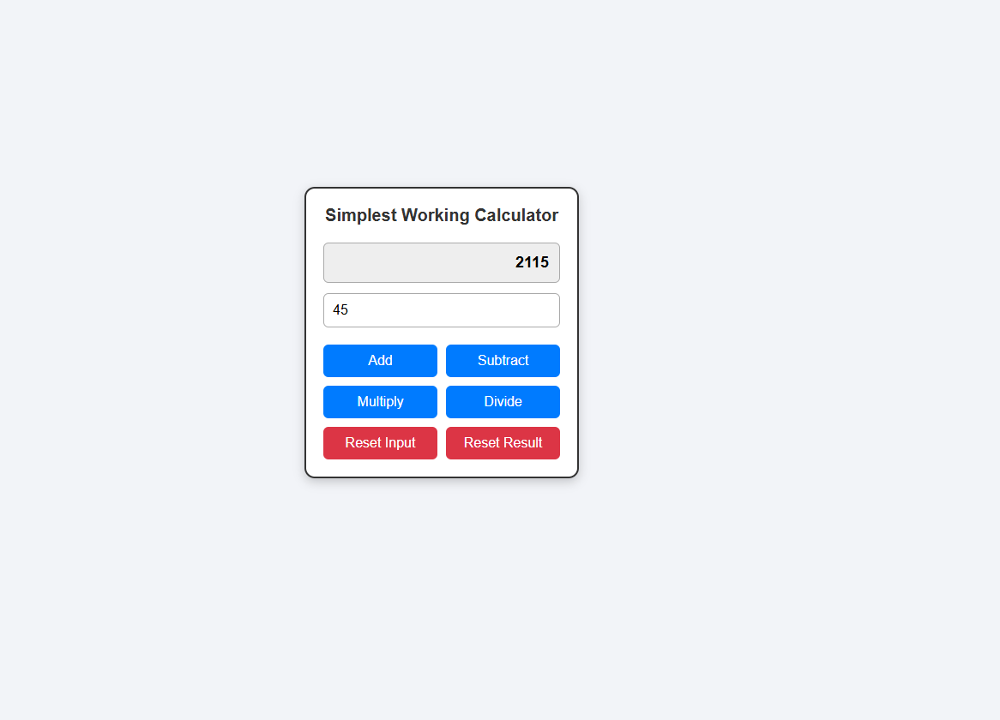

# 🧮 Simple React Calculator  

🌐 **Live Demo:** [View Project](https://amelchenni.github.io/simple-React-calculator/)  

---

## 📖 Description  
The **Simple React Calculator** is a beginner-friendly project built with React.  
It allows users to perform basic arithmetic operations in an intuitive interface.  
This project is designed as practice for React state management (`useState`) and component styling.  

---

## 🚀 Features  
- ➕ **Addition** – Add numbers easily.  
- ➖ **Subtraction** – Subtract numbers quickly.  
- ✖️ **Multiplication** – Multiply values.  
- ➗ **Division** – Divide numbers.  
- 🔄 **Reset Input** – Clear the input field.  
- 🧹 **Reset Result** – Reset the total back to zero.  
- 🎨 Clean and responsive UI for desktop & mobile.  

---

## 🛠️ Technologies Used  
- **React (Hooks: useState)** – Component logic & state handling  
- **JavaScript (ES6)** – Core functionality  
- **HTML5** – Structure  
- **CSS3** – Styling & layout  

---

## 📷 Preview  
  

---

## 📌 Future Improvements  
- Add **keyboard support** (use keyboard keys for operations).  
- Display a **history of operations**.  
- Improve styling with animations & themes (dark/light mode).  
- Add more complex functions (square root, power, percentage).  

---

## ▶️ Usage  
1. Clone this repository:  
   ```bash
   git clone https://github.com/AmelChenni/simple-React-calculator.git
